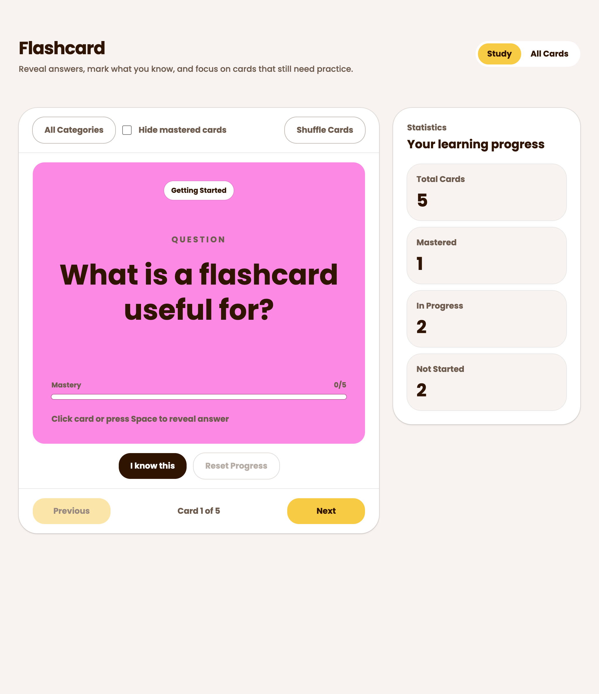
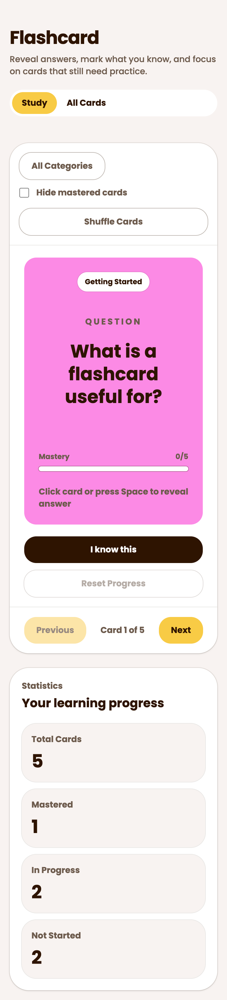
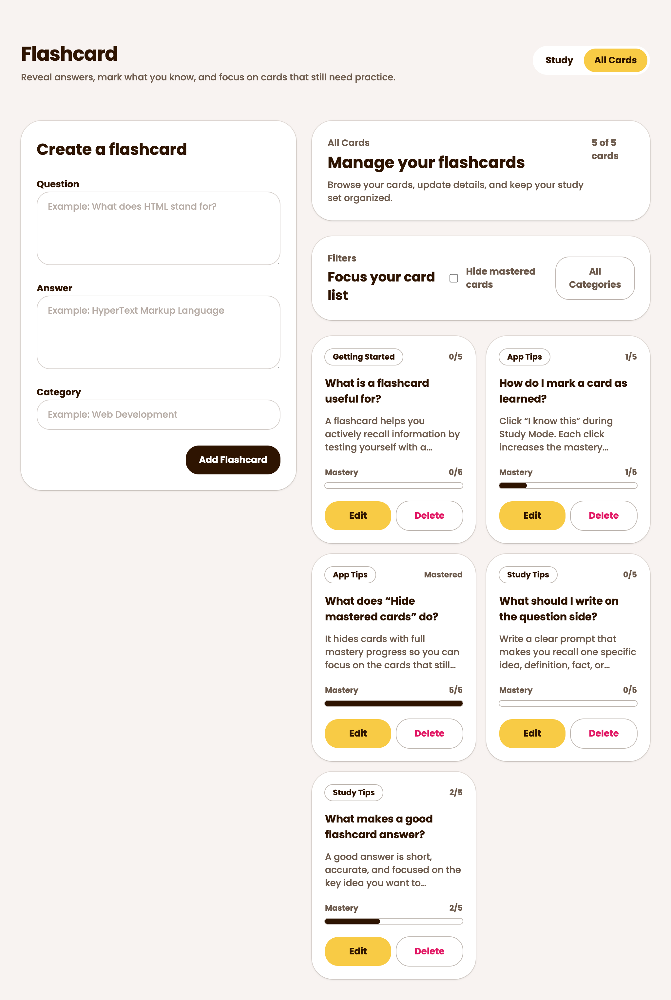

# Flashcard App

A responsive flashcard web application built with React, TypeScript, Vite, and Tailwind CSS.

This project was developed as a solution to the Flashcard App challenge from Frontend Mentor.

## Overview

The app allows users to create, edit, delete, filter, and study flashcards in an interactive study mode. User progress is persisted locally in the browser using localStorage.

## Features

- Create, edit, and delete flashcards
- Study Mode with flip interaction
- Progress tracking and mastery system
- Category filtering
- Hide mastered cards
- Shuffle study cards
- Keyboard shortcuts support
- Responsive layouts for mobile, tablet, and desktop
- Local persistence using browser localStorage

## Screenshots

### Study Mode — Desktop



### Study Mode — Mobile



### All Cards — Desktop



## Tech Stack

- React
- TypeScript
- Vite
- Tailwind CSS v4

## Project Structure

```txt
src/
├── features/
├── shared/
├── app/
└── main.tsx
```

### Architecture Notes

The project uses a feature-based folder structure to separate concerns by domain.

Examples:

- `features/study`
- `features/flashcards`
- `features/filters`
- `features/statistics`

Reusable UI components and utilities are placed inside `shared`.

## State Management

Flashcard state is managed using React reducers and persisted to localStorage.

The reducer handles:

- create
- update
- delete
- progress updates
- reset progress

## Study Mode

Study Mode includes:

- flip-card interaction
- category filtering
- hide mastered cards
- shuffle mode
- keyboard shortcuts

Keyboard shortcuts:

- `Space` → reveal/hide answer
- `Arrow Left` → previous card
- `Arrow Right` → next card

## Accessibility Considerations

The project includes:

- semantic HTML structure
- keyboard interaction support
- focus-visible states
- accessible button labels
- modal focus management

## Getting Started

### Install dependencies

```bash
npm install
```

### Run development server

```bash
npm run dev
```

### Build for production

```bash
npm run build
```

## Live Demo

## Author

Built by Shagara.
